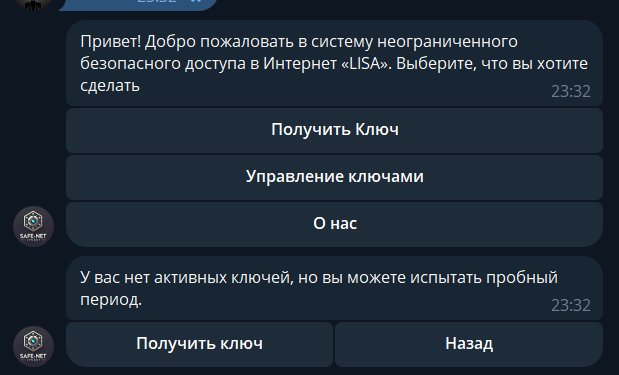

# TODO

1. после получения ключа и инструкции нужна кнопка посмотреть все ключи и получить еще ключ

2.  внешний процесс который раз в несколько времени пробегается по бд и удаляет из outline ключи которые закончились действовать

3. Переходы из состояния "Управление ключами"

4. В менеджере ключей генерировать список ключей в виде списка кнопок
и чтобы по нажатию производить действия с конкретно выбранным ключом:
поменять его название, продлить период, etc.
# IDEAS

# NOTES
1.  Плохо что хэндлеры несут много ответственности, нужно вынести функционал в отдельные классы/функции
2. наверное лучше в коде период подписки хранить в днях (как платежи в копейках)
3. 
# DONE

1. Получение пробного периода на 15 дней если еще не был использован
Если был использован, то сообщение об этом и возможность вернуться назад.
2. 