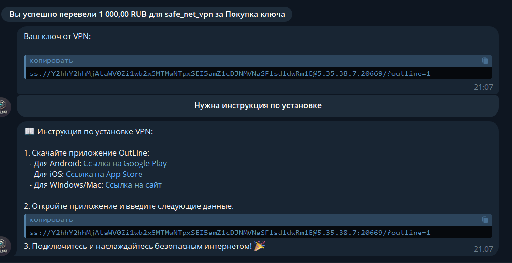
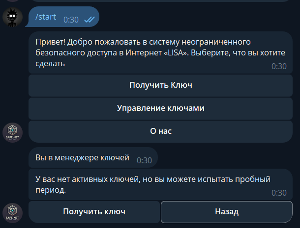
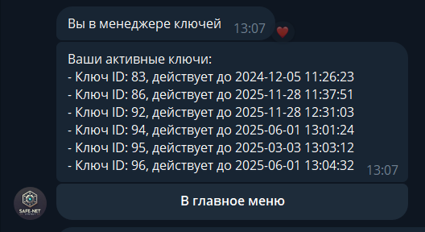
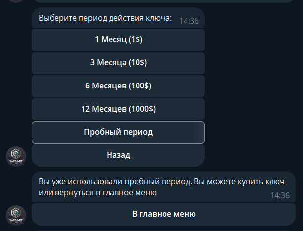

# TODO

1. после получения ключа и инструкции нужна кнопка посмотреть все ключи и получить еще ключ

2.  внешний процесс который раз в несколько времени пробегается по бд и удаляет из outline ключи которые закончились действовать

3. В менеджере ключей генерировать список ключей в виде списка кнопок
и чтобы по нажатию производить действия с конкретно выбранным ключом:
поменять его название, продлить период, etc.

4. Если нет активных ключей кнопки не рабочие

5. Находясь в менеджере ключей нужно иметь возможность, тыкнув на ключ (ключи должна быть в виде кнопок на клавиатуре с именами ключей или их id)
перейти на панель действий с ним: 
- увидеть сам ключ (ssl//:...)
- переименовать его
- продлить его действие
- узнать срок окончания действия

6. При отсутствии пробного периода должна быть кнопка в меню или обратно к выбору периода, а не только обратно в главное меню

# IDEAS

# NOTES
1.  Плохо что хэндлеры несут много ответственности, нужно вынести функционал в отдельные классы/функции
2. наверное лучше в коде период подписки хранить в днях (как платежи в копейках)
3. 
# DONE

02.12: Получение пробного периода на 15 дней если еще не был использован
Если был использован, то сообщение об этом и возможность вернуться назад.

03.12: 
- сделаны 3 роутера для всего, что связано с главным меню, платежами, менеджером ключей
- в `src/utils` создан файл `send_message.py` для функций связанных с отправкой сообщений (не зависящих от контекста)
- `utils/outline_processor.py` создана функция `create_vpn_key` для внешнего использования, функция `_create_new_key` стала приватной
- `src/bot/initialization` - папка с инициализацией единожды бота (bot), db_processor, outline_processor - использовать во всех внешних модулях
- в `db_processor` вынесена функция по обновлению БД `update_database_with_key` после создания нового ключа